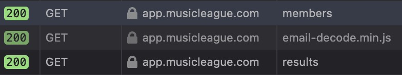

# Music League Voting Similarity
Compare voting similarity of all members of a [Music League](https://app.musicleague.com/) and generate an HTML results table and/or an animated cluster graph video (example coming soon)


### Python Setup:
1. Clone the repo
    ```
    git clone https://github.com/jumpingboy/music-league-voting.git
    ```
2. Install [poetry](https://python-poetry.org/docs/#installation) and [pyenv](https://github.com/pyenv/pyenv#installation) (or your python version manager of choice)
- (If you prefer not to use poetry, a `requirements.txt` file has also been included so `pip install` should work)
3. Install the python version for this repo, tell poetry where to find it, install dependencies, and launch a shell in the environment you just created
    ```
    pyenv install 3.11:latest
    poetry env use <path_to_python>
    poetry install
    poetry shell
    ```
4. Poetry tip: To set your poetry virtual environment as the Python interpreter in your IDE, you usually need the full path to the Python version in your virtual environment. When you run `poetry shell` you will see something like 
    `/Users/bob-loblaw/Library/Caches/pypoetry/virtualenvs/music-league-voting-1hfJBfdf-py3.9/bin/activate`
    Change `activate` to `python`, and that's your path.
    You can also find the path to your virtualenv with `poetry show -v`, then just add `/bin/python` to the end, and that's your path.

### Automatic data import:
1. Log in to MusicLeague in Firefox (recommended) or Chrome, with cookies enabled. You can close the browser once you are fully logged in.
2. From inside a poetry shell, run:
```python download_results.py```
3. If you get a permissions popup, type the password you use to log in to your computer and click "Always Allow"
4. That's it!

### Manual data import
If the automatic data import doesn't work for you:
1. Run ```python download_results.py``` and choose the option "I'll do it manually"
2. Log into Music League in your browser and click on the Results page for Round 1 of your league
4. Open the developer console in your browser. In the Network tab, look for calls to `members` and `results` endpoints

-- If you don't see calls to those endpoints, make sure the developer console is and then do a hard refresh (`command + shift + R` for Mac, or `ctrl + shift + R` on a PC)
5. For the remaining steps, you should be looking in the folder for your league:
```
leagues
├── Your League Name
│   ├── members.json
│   ├── name_map.json
│   └── results
│       └── round_1.json
```
5. Copy the `members` response into `members.json` (You only need to do this once per league, not for all rounds)
6. Copy the `results` response into `results/round_1.json`, and repeat for all rounds.
7. **Recommended:** Fill out `name_map.json` to translate members' Music League usernames into shorter or more familiar names. Display names of 8 characters or fewer are recommended.

### Generate Your Results Table
1. Enter a poetry shell with
```
poetry shell
```
2. Run
```
python similarity.py
```
3. Open the resulting `similarity_table.html` file, which should open it in your browser
4. Select all the **contents** of the page (not the url) and copy
5. Before pasting into an email, hit enter a few times so you have a few blank rows at the top where you can type your comments, then paste the table into the email

### Generate Your Cluster Video
1. Enter a poetry shell with
```
poetry shell
```
2. Run
```
python graph.py
```
3. You will see a new mp4 file in the `output` folder, but wait until the python script finishes running before trying to open it.
4. Change the file name if you want: the output is named with a timestamp by default.
