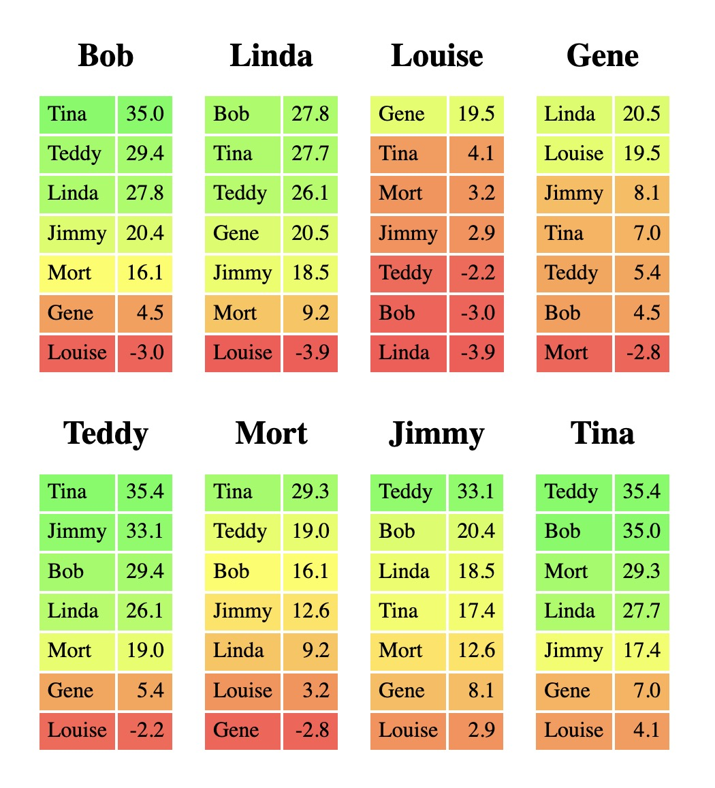

# Music League Voting Similarity
Compare voting similarity of all members of a [Music League](https://app.musicleague.com/) and generate an HTML results table and/or an animated cluster graph video (example coming soon)



### Python Setup:
1. Clone the repo
    ```
    git clone https://github.com/jumpingboy/music-league-voting.git
    ```
2. Install [poetry](https://python-poetry.org/docs/#installation) and [pyenv](https://github.com/pyenv/pyenv#installation) (or your python version manager of choice)
- (If you prefer not to use poetry, a `requirements.txt` file has also been included so `pip install` should work)
3. Install the python version for this repo, tell poetry where to find it, install dependencies, and launch a shell in the environment you just created
    ```
    pyenv install 3.11:latest
    poetry env use <path_to_python>
    poetry install
    poetry shell
    ```
4. Poetry tip: To set your poetry virtual environment as the Python interpreter in your IDE, you usually need the full path to the Python version in your virtual environment. When you run `poetry shell` you will see something like 
    `/Users/bob-loblaw/Library/Caches/pypoetry/virtualenvs/music-league-voting-1hfJBfdf-py3.9/bin/activate`
    Change `activate` to `python`, and that's your path.
    You can also find the path to your virtualenv with `poetry show -v`, then just add `/bin/python` to the end, and that's your path.

### Data Setup
1. **You or someone in your league (maybe the league admin) must be subscribed to Music League to enable data export**
2. If you are subscribed, there should be an option in the menu for the league page to Export Data
3. In your poetry shell for this repo, run `python new_league_folder.py`
4. Expand the zip file, and drag the csv files into the league folder that was just created, which should look something like this
```
leagues
----My New League
--------competitors.csv
--------rounds.csv
--------submissions.csv
--------votes.csv
--------<and other files and folders>

```
5. **Recommended:** Fill out `name_map.json` to translate members' Music League usernames into shorter or more familiar names. Display names of 8 characters or fewer are recommended.
6. Fill out the values in `league_settings.json` according to the voting settings in your league.

### Generate Your Results Table
1. Enter a poetry shell with
```
poetry shell
```
2. Run
```
python similarity.py
```
3. Open the resulting `similarity_table.html` file, which should open it in your browser
4. Select all the **contents** of the page (not the url) and copy
5. Before pasting into an email, hit enter a few times so you have a few blank rows at the top where you can type your comments, then paste the table into the email

### Generate Your Cluster Video
1. Enter a poetry shell with
```
poetry shell
```
2. Run
```
python cluster_video.py
```
3. You will see a new mp4 file in the `output` folder, but wait until the python script finishes running before trying to open it.
4. Change the file name if you want: the output is named with a timestamp by default.
